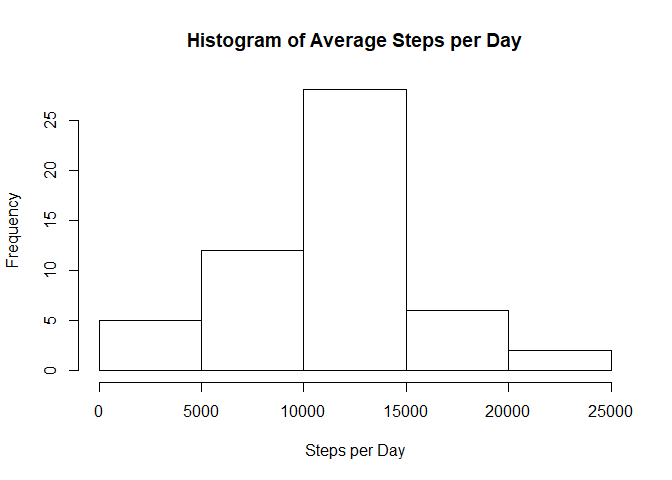
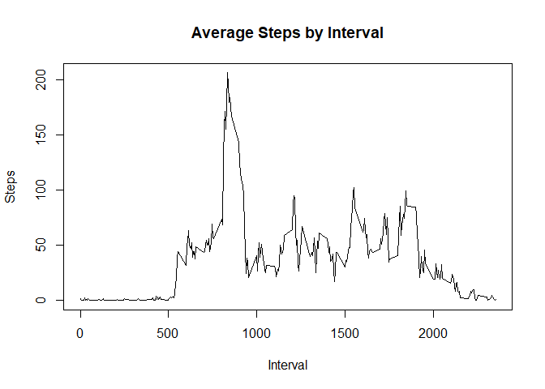
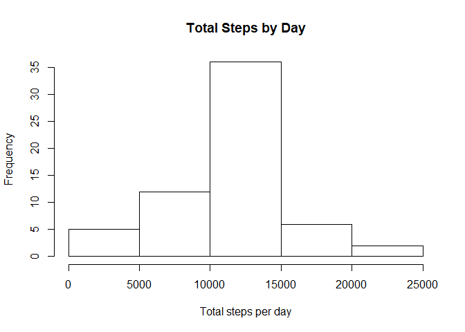
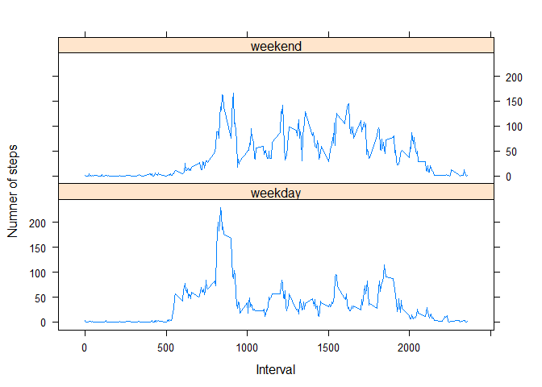

## Part 1 - Load and preprocessing the data

```r
download.file("https://d396qusza40orc.cloudfront.net/repdata%2Fdata%2Factivity.zip",destfile="./data.zip")
unzip("./data.zip")
activity <- read.csv("./activity.csv")
activity2 <- activity[complete.cases(activity$steps),]
```
## Part 2 - Mean of total number of steps taken per day

```r
steps <- aggregate(activity2$steps,by = list(activity2$date),sum)
hist(steps$x,main = "Histogram of Average Steps per Day",xlab = "Steps per Day")
```

<!-- -->

The average daily steps and median daily steps respectively are:

```r
mean(steps$x)
```

```
## [1] 10766.19
```

```r
median(steps$x)
```

```
## [1] 10765
```

## Part 3 - Average daily activity pattern
This is a histogram of average daily activity by Interval

```r
int <- aggregate(activity2$steps,by=list(activity2$interval),mean)
plot(int$Group.1,int$x,type = "l",main="Average Steps by Interval",xlab = "Interval",ylab = "Steps")
```

<!-- -->

The interval with the maximum number of steps on average is:

```r
int[max(int$x),]
```

```
##     Group.1        x
## 206    1705 56.30189
```

## Part 4 - Imputing missing values
Here is the total number of NAs in the 'steps' column:

```r
sum(is.na(activity$steps))
```

```
## [1] 2304
```

This is a histogram of the total number of steps taken each day. Missing data has been imputed based on the mean for the corresponding interval


```r
activity3 <- activity
activity3[is.na(activity$steps),"steps"] <-
    tapply(activity3$steps,activity$interval,mean,na.rm=TRUE)

steps2 <- aggregate(activity3$steps,by = list(activity3$date),sum)
hist(steps2$x,main = "Total Steps by Day",xlab = "Total steps per day",ylab = "Frequency")
```

<!-- -->

The mean and median of the imputed dataset respectively are:

```r
mean(steps2$x)
```

```
## [1] 10766.19
```

```r
median(steps2$x)
```

```
## [1] 10766.19
```

The mean of the data is unchanged following the imputing of data to correct for missing values (NAs), this is expected as the missing data has been replaced with the mean of the existing data.  

The median of the data is now equal to the mean because I have used it for the missing data - increasing its frequency. 

The imputing of missing data shifts the centre of the histogram upwards.

## Part 5 - Weekdays vs. Weekends

```r
library(lattice)
activity3$date <- as.Date(activity3$date)
activity3$day <- ifelse(weekdays(activity3$date) %in%   
                c("Saturday","Sunday"),"weekend","weekday")
steps3 <- aggregate(.~interval+day,activity3,mean)
day.f <- factor(steps3$day,levels = c("weekday","weekend"),labels = c("weekday","weekend"))
xyplot(steps~interval|day.f,data = steps3,type = "l", ylab = "Numner of steps", xlab = "Interval",layout=c(1,2))
```

<!-- -->

